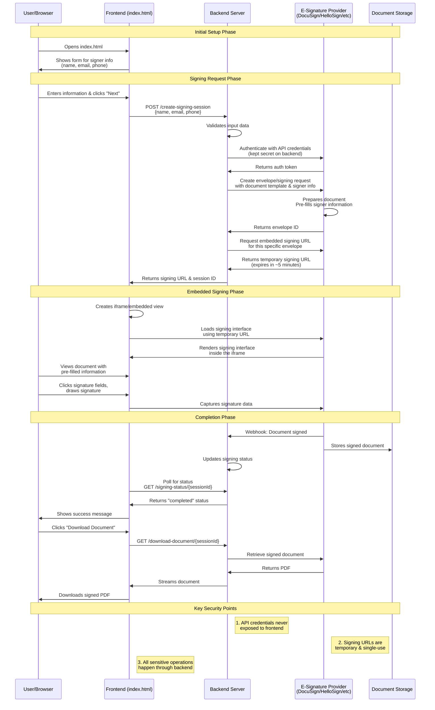

```mermaid
sequenceDiagram
    participant User as User/Browser
    participant Frontend as Frontend (index.html)
    participant Backend as Backend Server
    participant API as E-Signature Provider<br/>(DocuSign/HelloSign/etc)
    participant Doc as Document Storage

    Note over User,Doc: Initial Setup Phase
    User->>Frontend: Opens index.html
    Frontend->>User: Shows form for signer info<br/>(name, email, phone)

    Note over User,Doc: Signing Request Phase
    User->>Frontend: Enters information & clicks "Next"
    Frontend->>Backend: POST /create-signing-session<br/>{name, email, phone}

    Backend->>Backend: Validates input data
    Backend->>API: Authenticate with API credentials<br/>(kept secret on backend)
    API->>Backend: Returns auth token

    Backend->>API: Create envelope/signing request<br/>with document template & signer info
    API->>API: Prepares document<br/>Pre-fills signer information
    API->>Backend: Returns envelope ID

    Backend->>API: Request embedded signing URL<br/>for this specific envelope
    API->>Backend: Returns temporary signing URL<br/>(expires in ~5 minutes)

    Backend->>Frontend: Returns signing URL & session ID

    Note over User,Doc: Embedded Signing Phase
    Frontend->>Frontend: Creates iframe/embedded view
    Frontend->>API: Loads signing interface<br/>using temporary URL
    API->>Frontend: Renders signing interface<br/>inside the iframe

    User->>Frontend: Views document with<br/>pre-filled information
    User->>Frontend: Clicks signature fields,<br/>draws signature
    Frontend->>API: Captures signature data

    Note over User,Doc: Completion Phase
    API->>Backend: Webhook: Document signed
    API->>Doc: Stores signed document
    Backend->>Backend: Updates signing status

    Frontend->>Backend: Poll for status<br/>GET /signing-status/{sessionId}
    Backend->>Frontend: Returns "completed" status

    Frontend->>User: Shows success message
    User->>Frontend: Clicks "Download Document"
    Frontend->>Backend: GET /download-document/{sessionId}
    Backend->>API: Retrieve signed document
    API->>Backend: Returns PDF
    Backend->>Frontend: Streams document
    Frontend->>User: Downloads signed PDF

    Note over User,Doc: Key Security Points
    Note right of Backend: 1. API credentials never<br/>exposed to frontend
    Note right of API: 2. Signing URLs are<br/>temporary & single-use
    Note right of Frontend: 3. All sensitive operations<br/>happen through backend
```
